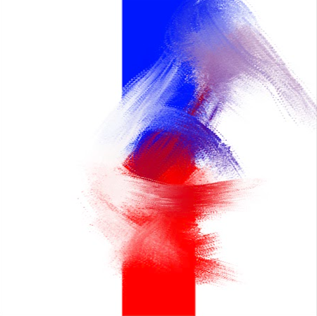
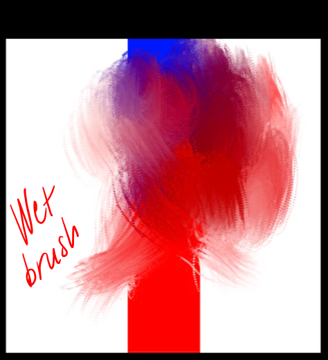
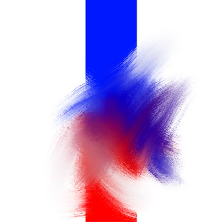
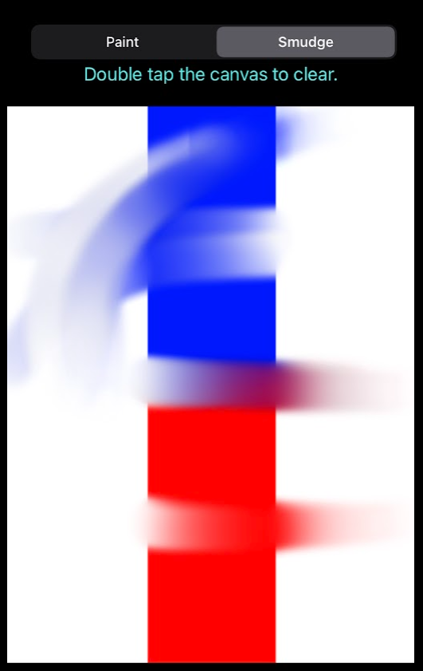

# Simple implementation of "smudge" and "wetbrush" etc. in Core Graphics.

## NOTE: this is not very performant, it simply illustrates the logic that goes into implementing a smudge brush. This is a test suite made for later implementation in Metal.

The example uses a UIImage as a back buffer to draw into. The UIImage then draws itself into the backing layer.

### **Smudge**

- Before each touch, the UIImage draws itself into the current image context.

- For each previous touch pos, we copy a Region Of Interest(ROI), determined by the size of the current brush, from the current CGContext. We mask the copy and then draw it into the current context with appropriate settings, most notably an appropriate alpha setting. Thus the UIImage gets updated.

- The updated UIImage then draws itself into the view's backing layer to reflect each incremental change.

### **Wet brush**

- Wet brush is related to the smudge brush, with the main difference that the wet brush also holds an intrinsic color, that blends bidirectionally with paint lying on the canvas. That is, the brush picks up color from the canvas, as well as depositing paint. At any one time, the direction of paint transfer can only flow in one direction, but over of time, this flow is bidirectional.

# **Discussion**

To implement a production code, you would use the same basic logic (there are no rules, just do whatever fits your needs), but implement it in *Metal* (or any other framework that takes advantage of the GPU). *Core Graphics* works on the CPU, then pushes to the GPU, and will thus not utilize the full potential of the GPU hardware. *Core Image*, while GPU based, is not geared toward 60+ FPS drawing and will bottleneck, worse than Core Graphics. Ideally, you should explore *Metal*. But that will unfortunately add alot of complexity to your code. But you gain speed and fine granular control.

